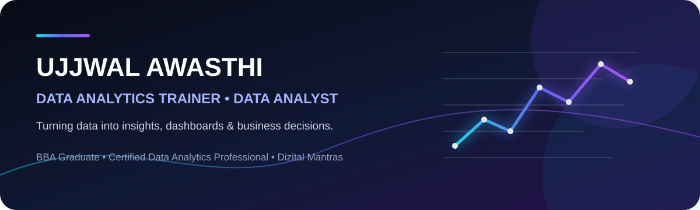

<div align="center">



<p>
<a href="https://www.linkedin.com/in/ujjwal-awasthi-443552254/"></a>
<a href="mailto:ujjwalawasthi79@gmail.com"></a>
<a href="https://github.com/ujjwalawasthi79"></a>
</p>

### 📊 Data Analytics Trainer & Data Analyst
**BBA Graduate • Certified Data Analytics Professional • Trainer at Dizital Mantras**

</div>

---

## 👋 About Me

I am **Ujjwal Awasthi**, a **BBA graduate and certified Data Analytics professional**, currently working as a **Data Analytics Trainer at Dizital Mantras**.

I combine business understanding with analytics to transform raw data into **clear dashboards, actionable insights and decision-ready stories**.

As a trainer, I also help learners build practical analytics skills through hands-on projects and real-world examples.

> **My approach:** Business Problem → Data Cleaning → Analysis → Visualization → Insights → Recommendation

---

## 🧰 Analytics Toolkit

| 📊 Analysis | 🗄️ SQL | 📈 BI & Visualization | 🐍 Programming |
|---|---|---|---|
| Data Cleaning | Queries | Power BI | Python |
| EDA | Joins | KPI Dashboards | Pandas |
| KPI Analysis | Aggregations | Data Storytelling | Visualization |
| Business Insights | Filtering | Reporting | Exploration |

<p align="center">


</p>

---

# 🚀 Featured Analytics Projects

## 01 • Technova 2024 — Sales & Profit Analysis

**Power BI · Business Intelligence · Data Visualization**

A business-focused dashboard analyzing Technova's 2024 performance across revenue, profit, customer reviews, sales channels, regions and salespersons.

<div align="center">


</div>

### 📌 Executive Snapshot

| 💰 Revenue | 📈 Profit | ⭐ Reviews | 🌐 Online | 🏬 Retail |
|---:|---:|---:|---:|---:|
| **10.14M** | **2.81M** | **4,000** | **51.85%** | **48.15%** |

### 💡 Key Business Insights

- Online and retail channels show a balanced omnichannel mix.
- Regional profitability identifies the strongest contributing markets.
- Monthly revenue trends reveal performance fluctuations.
- Top profitable orders have a meaningful impact on profitability.
- Salesperson analysis highlights high-value contributors.

**Business Value:** Converts multiple performance indicators into a single interactive view for faster monitoring and decision-making.

---

## 02 • Sales Performance Dashboard

**Power BI · Sales Analytics · KPI Reporting**

An interactive dashboard covering business performance across departments, regions, categories and years.

<div align="center">


</div>

### 📌 Executive Snapshot

| 💰 Total Sales | 📊 Average Sale | 👥 Customers |
|---:|---:|---:|
| **393M** | **78.58K** | **5,000** |

### 💡 Key Business Insights

- Marketing and Sales are among the strongest contributors.
- Regional performance is distributed across multiple regions.
- Year-wise trends provide a clear view of sales movement.
- Top sales representatives can be compared for performance.

**Business Value:** Gives decision-makers a quick view of high-performing departments, regions and sales representatives.

---

# 🎓 Education & Certification

### 🎓 Bachelor of Business Administration — BBA

Business foundation with an understanding of management, organizations and business decision-making.

### 📜 Data Analytics Certification

Certified in Data Analytics with practical exposure to data analysis, visualization and business intelligence tools.

---

# 👨‍🏫 Experience

### Data Analytics Trainer — Dizital Mantras

Currently working as a **Data Analytics Trainer**, helping learners develop practical skills in:

**Excel • SQL • Power BI • Python • Data Visualization • Analytics Concepts**

My training approach is practical and business-oriented, using hands-on projects and real-world examples to turn concepts into usable skills.

---

# 🔄 My Analytics Workflow

```text
        RAW DATA
            │
            ▼
     🧹 DATA CLEANING
            │
            ▼
      🔍 EXPLORATION
            │
            ▼
      SQL / PYTHON
            │
            ▼
     📊 VISUALIZATION
            │
            ▼
       📈 DASHBOARD
            │
            ▼
      💡 INSIGHTS
            │
            ▼
    🎯 RECOMMENDATIONS
```

---

# 🌟 What I Bring

| Strength | What it means |
|---|---|
| 📊 Analytical Thinking | Turning data into clear business questions |
| 🧹 Data Preparation | Cleaning and preparing data for reliable analysis |
| 🗄️ SQL Problem Solving | Extracting and aggregating useful information |
| 📈 Dashboarding | Building decision-friendly KPI views |
| 🐍 Python Analysis | Exploring, cleaning and visualizing data |
| 🎓 Training | Explaining analytics concepts through practical work |
| 💡 Data Storytelling | Communicating insights clearly |

---

# 📂 Portfolio Roadmap

I am continuously expanding this portfolio with projects in:

**Excel → SQL → Python → Power BI → End-to-End Business Analytics**

Each project is designed to demonstrate the complete journey from **raw data to actionable insight**.

---

# 📫 Let's Connect

Interested in **Data Analytics, Business Intelligence, training or collaboration?**

<div align="center">

<a href="https://www.linkedin.com/in/ujjwal-awasthi-443552254/"></a>
<a href="mailto:ujjwalawasthi79@gmail.com"></a>

</div>

---

<div align="center">

### 📊 Turning Data Into Decisions.
### 🎓 Turning Knowledge Into Skills.

**⭐ If you find my work useful, consider starring a project!**

</div>
